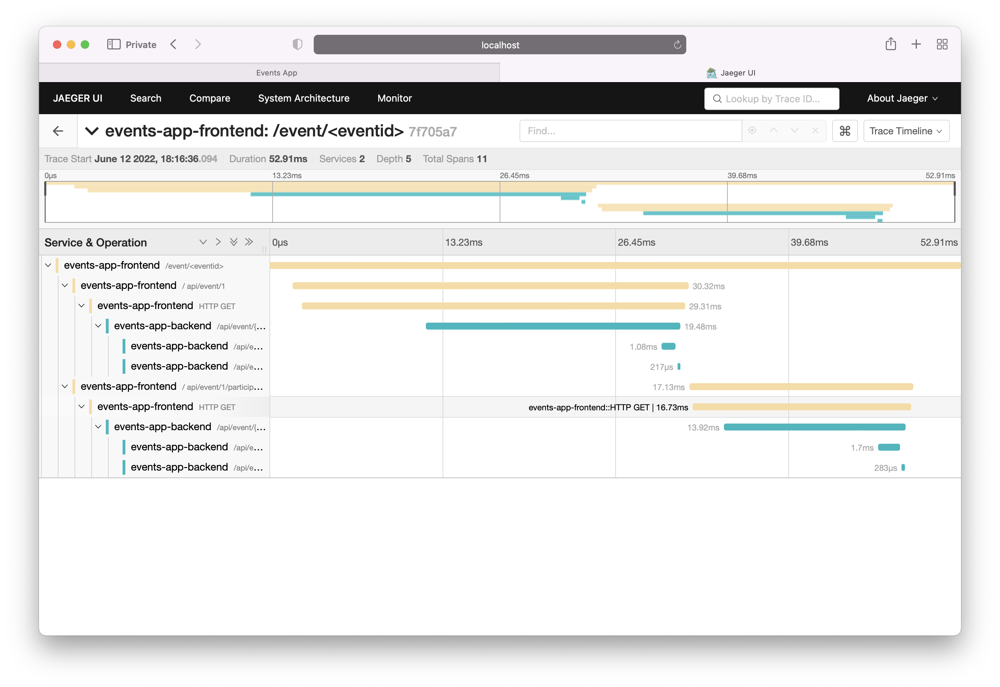
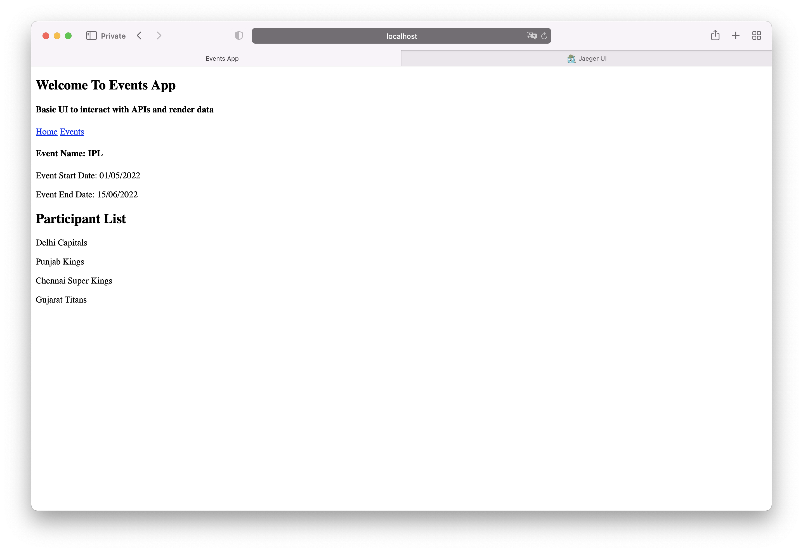

# events-app-opentelemetry
Opentelemetry POC with a sample Python based events app

Events App is a simple python application with the following components:

- Frontend - Flask based application with basic HTML templates
- Backend -  Backend API is built using the FastAPI framework
- Datastore - Postgresql

The frontend makes API calls to the backend system which in-turn queries and returns data from the Postgresql container. The data from the backend is then rendered on the frontend.

All calls across application components are traced by opentelemetry. Telemetry data is presented on Jaeger dashboard giving insights in the application performance, network calls and response times.




## Requirements 

To run the POC, following applications should be avaialble on the local machine

- Docker
- docker-compose
- make

## Spin Up Stack

Run the below command to bring up the POC environment

```bash
$ git clone https://github.com/rishabhdas/events-app-opentelemetry.git
$ cd events-app-opentelemetry
$ make all
```

## Browse Application

Web UI - http://localhost:3000/
Jaeger - http://localhost:16686/


## App Details

### UI Component - Endpoints

| Path | Description |
|------|-------------|
| /    | Home Page - Welcome to the platform |
| /events | List of events |
| /event/id | Event Details |

<br>

### Backend Component - APIs

| Path | Description |
|------|-------------|
| /api/events | List of events |
| /api/event/id | Event Details |
| /api/event/id/participants | Event Participants |

<br>

### Data Store - Postgres

<br>

**Database Name - eventsapp**

<br>

**Table - events**

| eventid | eventname | startdate | enddate |
|---------|---------|---------|---------|
| 1 | IPL | 01/05/2022 | 15/06/2022 |
| 2 | IFL | 15/05/2022 | 20/06/2022 |

<br>

**Table - participants**

| eventid | pname |
|---------|---------|
| 1 | Delhi Capitals |
| 1 | Punjab Kings |
| 1 | Chennai Super Kings |
| 1 | Gujarat Titans |
| 2 | Bucks |
| 2 | Storm |
| 2 | Panthers |
| 2 | Columbus Wild Dogs |
